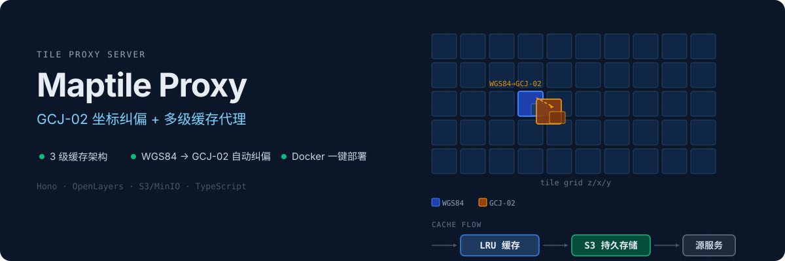

<p align="center">
  
</p>

## Quick Start

```bash
git clone <repository-url>
cd maptile-proxy
pnpm install
cp .env.example .env
# 编辑 .env 设置 MAP_SOURCE
pnpm dev
```

请求瓦片：

```bash
curl "http://localhost:5000/appmaptile?x=100&y=200&z=10" --output tile.png
```

## Docker

```bash
docker build -t maptile-server .

# 基本运行
docker run -p 5000:5000 \
  -e MAP_SOURCE="https://api.maptiler.com/maps/satellite/{z}/{x}/{y}.jpg?key=YOUR_KEY" \
  maptile-server

# 使用 S3 持久缓存
docker run -p 5000:5000 \
  -e MAP_SOURCE="https://api.maptiler.com/maps/satellite/{z}/{x}/{y}.jpg?key=YOUR_KEY" \
  -e S3_BUCKET=map-tiles \
  -e AWS_REGION=us-east-1 \
  -e AWS_ACCESS_KEY_ID=your-key \
  -e AWS_SECRET_ACCESS_KEY=your-secret \
  maptile-server

# 使用 MinIO
docker run -p 5000:5000 \
  -e MAP_SOURCE="https://api.maptiler.com/maps/satellite/{z}/{x}/{y}.jpg?key=YOUR_KEY" \
  -e S3_ENDPOINT=http://minio:9000 \
  -e S3_BUCKET=map-tiles \
  -e AWS_ACCESS_KEY_ID=minioadmin \
  -e AWS_SECRET_ACCESS_KEY=minioadmin \
  maptile-server

# 使用环境文件
docker run -p 5000:5000 --env-file .env maptile-server
```

## API

| Endpoint | Method | Description |
|---|---|---|
| `/appmaptile?x={x}&y={y}&z={z}` | GET | 获取地图瓦片（自动 GCJ-02 纠偏） |
| `/health` | GET | 健康检查 + 缓存状态 |
| `/cache-stats` | GET | 缓存统计详情 |
| `/reset-cache` | POST | 重置内存缓存和渲染层 |
| `/s3-cache/check?x={x}&y={y}&z={z}` | GET | 检查 S3 缓存（需启用 S3） |
| `/s3-cache/clear?x={x}&y={y}&z={z}` | POST | 清除指定瓦片的 S3 缓存 |

### 示例

```bash
# 获取瓦片
curl "http://localhost:5000/appmaptile?x=100&y=200&z=10"

# 健康检查
curl http://localhost:5000/health

# 缓存统计
curl http://localhost:5000/cache-stats
```

## Architecture

```
Client → LRU Memory Cache → S3 Persistent Cache → Tile Source
              ↓ (miss)              ↓ (miss)           ↓
         check next layer      check next layer    fetch + transform
              ↓ (hit)               ↓ (hit)
           return tile          return tile + async save to LRU
```

**缓存策略：**
- **LRU 内存** — 最近使用的瓦片，快速响应（默认 200 片）
- **S3 持久存储** — 跨重启保留，异步写入不阻塞请求
- **源服务** — WGS84 → GCJ-02 坐标转换后获取

**坐标纠偏：**
- WGS84 (`EPSG:4326`) → GCJ-02（火星坐标系）
- Web Mercator (`EPSG:3857`) → GCJ-02
- 中国境外坐标自动跳过纠偏

## Configuration

### 基础配置

| 变量 | 说明 | 默认值 |
|---|---|---|
| `PORT` | 服务端口 | `5000` |
| `MAP_SOURCE` | 瓦片源 URL 模板 | MapTiler |
| `CACHE_MAX_SIZE` | 内存缓存上限 | `200` |
| `CACHE_RESET_INTERVAL` | 缓存重置间隔 (ms) | `60000` |
| `TILE_LOAD_TIMEOUT` | 瓦片加载超时 (ms) | `30000` |
| `LOG_LEVEL` | 日志级别 | `info` |

### S3 配置

| 变量 | 说明 | 必填 |
|---|---|---|
| `S3_BUCKET` | S3 存储桶名称 | ✅ |
| `AWS_REGION` | AWS 区域 | ✅ |
| `AWS_ACCESS_KEY_ID` | Access Key（IAM 可省略） | ❌ |
| `AWS_SECRET_ACCESS_KEY` | Secret Key（IAM 可省略） | ❌ |
| `S3_ENDPOINT` | S3 端点（MinIO 等） | ❌ |
| `S3_PREFIX` | 瓦片存储前缀 | `tiles` |

> S3 仅在配置了 `S3_ENDPOINT` 或 `AWS_ACCESS_KEY_ID` + `AWS_SECRET_ACCESS_KEY` 时启用。未配置时仅使用内存缓存。

## Development

```bash
pnpm dev          # 开发模式（热重载）
pnpm build        # 生产构建
pnpm lint         # 代码检查
pnpm type-check   # 类型检查
```

### 项目结构

```
src/
├── index.ts      # Hono 服务 + LRU 缓存 + 瓦片获取
├── gcj02.ts      # GCJ-02 坐标转换算法
└── storage.ts    # S3 持久存储实现
```

## License

[ISC](LICENSE)